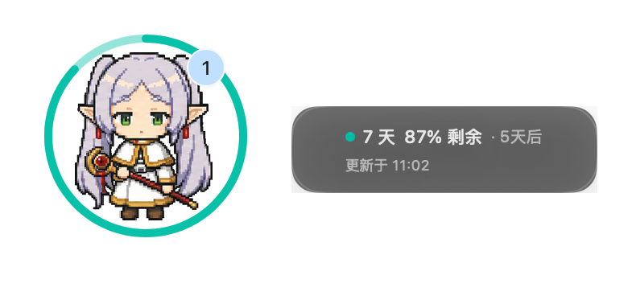
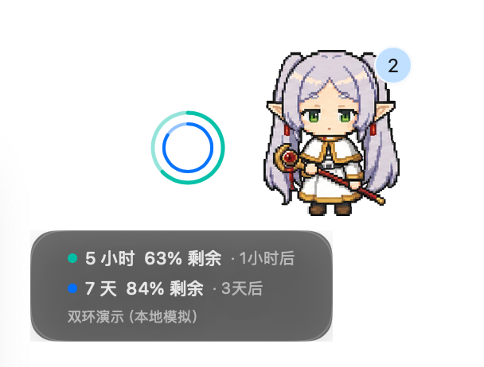

<p align="right">
  <a href="#中文">中文</a> · <a href="#english">English</a>
</p>

<a id="中文"></a>

# CodexUsageLoop for macOS

macOS 版 Codex 宠物用量伴随层。它将 5 小时和 7 天剩余比例显示在 Codex 宠物旁，并通过菜单栏提供控制。

## 界面示意

<p align="center">
  
  
</p>

<p align="center">
  <em>左：单窗口用量；右：双窗口用量。截图右上角的浅蓝“1”为说明标记，不属于应用界面。</em>
</p>

<p align="center">
  
</p>

<p align="center">
  <em>常驻详情卡会显示剩余比例、重置时间与最近更新时间；浅蓝“1”为说明标记，不属于应用界面。</em>
</p>

<p align="center">
  
</p>

<p align="center">
  <em>左侧布局示例：圆环与宠物分离，详情卡位于圆环下方。浅蓝“2”为说明标记，不属于应用界面。</em>
</p>

## 功能

- 围绕 pet 或固定在 pet 左右侧显示用量圆环；常驻卡片在围绕模式位于圆环右侧、在左右侧模式位于圆环正下方。
- 兼容 Codex pet 的原有交互：本项目只叠加用量展示，不影响 pet 的右键菜单、任务卡展开／收起或其他基础功能。
- 真实用量返回两个窗口时显示双环，并禁用“演示双环”以避免覆盖真实数据。
- 支持自由拖动、立即刷新、重新检测宠物位置／大小，以及原色和单色菜单栏图标。
- 可分别自定义外环和内环颜色；颜色以 sRGB 持久化，并支持恢复默认蓝绿。
- 无全局右键监听；不读取认证文件，不上传用量或屏幕画面。
- 用量每 30 秒刷新；宠物位置每 1 秒检查。成功位置会缓存，截图失败按 5 秒退避。

## 构建与启动

要求 macOS 13+、Xcode Command Line Tools，以及已登录的 Codex CLI 或 Codex Desktop。macOS 13 使用窗口几何估算；macOS 14+ 在已授予屏幕录制权限时可进一步使用像素级宠物定位：

```bash
zsh scripts/build-app.sh
open "dist/CodexUsageLoop.app"
```

## 权限与隐私

用量通过本机 `codex app-server --stdio` 的只读接口获取，不读取、解析或上传 `~/.codex/auth.json`。如需精确识别透明宠物窗口内的实际边界，**建议在 macOS“系统设置 → 隐私与安全性 → 屏幕录制”中授权 CodexUsageLoop**；图像只在本机内存中分析，不保存、不上传。

未授权时应用仍可通过宠物容器的窗口几何估算进行基本跟随，不会主动弹出授权请求；但在非默认布局、宠物实际边界与容器比例不同或任务卡片改变位置时，圆环的位置和直径可能出现偏差。授权后会使用当前窗口的像素边界进行定位，以获得更准确的贴合效果。

## 已知定位边界

当宠物特别靠近屏幕左侧或右侧边缘时，圆环的自动跟随可能失效。请将宠物稍微向屏幕内侧移动，保持圆环中心到左右边缘至少约为半个任务卡片宽度的距离，再重新检测宠物位置／大小。

## 开源 Release

项目采用 [MIT License](LICENSE)，Release 不提供 Developer ID 签名或 Apple 公证。发布者可执行：

```bash
zsh scripts/package-release.sh 0.1.0
```

脚本会生成 ZIP、SHA-256 和构建元数据。下载者应只从[官方 GitHub Releases](https://github.com/Rabbitmeaw/codex-usage-loop/releases)下载、核对校验和与 tag，并且不要关闭 Gatekeeper。详见[安全使用说明](docs/RELEASE_SECURITY.md)。

## 文档

- [用户手册](docs/MANUAL.md)
- [变更记录](CHANGELOG.md)
- [执行路线图](docs/execution/PROGRESS.md)
- [真实环境验收矩阵](docs/execution/MANUAL_ACCEPTANCE.md)
- [架构](docs/02-architecture.md)

<p align="right"><a href="#english">English ↓</a></p>

---

<a id="english"></a>

# CodexUsageLoop for macOS

A macOS companion overlay that places Codex usage rings beside the Codex pet and exposes controls from the menu bar.

## Features

- Shows usage rings around the pet or at its left/right; the persistent card sits to the ring’s right in around-pet mode and directly below it in side modes.
- Preserves native Codex pet interactions: this project adds a usage overlay only and does not affect the pet's context menu, task-card expand/collapse behavior, or other core functions.
- Displays real dual rings when two usage windows are available and disables the demo mode so simulated data never replaces real usage.
- Supports free dragging, immediate refresh, pet position/size recalibration, plus color and monochrome menu-bar icons.
- Lets you customize outer and inner ring colors independently; sRGB values persist and can be reset to the default blue/green palette.
- Uses no global right-click listener; never reads authentication files or uploads usage or screen imagery.
- Refreshes usage every 30 seconds and pet geometry every second. Successful geometry is cached; failed captures back off for five seconds.

## Build and run

Requires macOS 13+, Xcode Command Line Tools, and a signed-in Codex CLI or Codex Desktop installation. macOS 13 uses window-geometry estimation; macOS 14+ can additionally use pixel-level pet detection when Screen Recording permission is granted:

```bash
zsh scripts/build-app.sh
open "dist/CodexUsageLoop.app"
```

## Permissions and privacy

Usage is read from the local, read-only `codex app-server --stdio` interface. The app does not read, parse, or upload `~/.codex/auth.json`. For precise detection inside the transparent pet window, **we recommend granting CodexUsageLoop Screen Recording access** in macOS System Settings → Privacy & Security; frames are analyzed only in local memory and are never stored or uploaded.

Without permission, the app still follows the pet using an estimated window geometry and never prompts for access automatically. The ring's position or diameter can be less accurate with non-default layouts, a mascot whose visible boundary differs from the container proportions, or a repositioned task card. Granting access enables pixel-level detection of the current window for a closer fit.

## Known positioning boundary

Automatic ring tracking can fail when the pet is extremely close to the left or right edge of a display. Move the pet slightly inward so the ring center remains at least roughly half a task-card width from either side, then use **Re-detect pet position / size**.

## Open-source releases

The project is licensed under the [MIT License](LICENSE). Releases do not have a Developer ID signature or Apple notarization. Maintainers can run:

```bash
zsh scripts/package-release.sh 0.1.0
```

The script creates a ZIP, SHA-256 checksum, and build metadata. Download only from the [official GitHub Releases](https://github.com/Rabbitmeaw/codex-usage-loop/releases), verify the checksum and tag, and do not disable Gatekeeper. See the [release security guide](docs/RELEASE_SECURITY.md).

## Documentation

- [User manual](docs/MANUAL.md)
- [Changelog](CHANGELOG.md)
- [Delivery roadmap](docs/execution/PROGRESS.md)
- [Manual acceptance matrix](docs/execution/MANUAL_ACCEPTANCE.md)
- [Architecture](docs/02-architecture.md)

<p align="right"><a href="#中文">中文 ↑</a></p>
