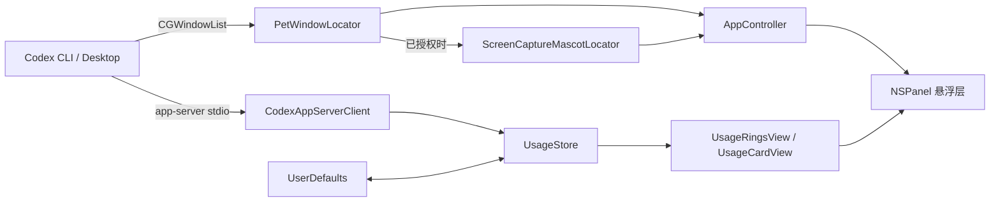
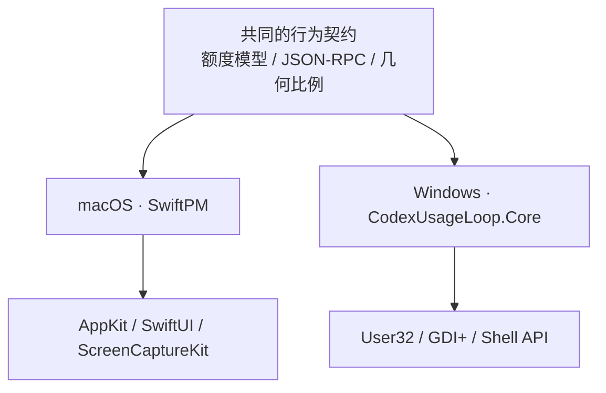
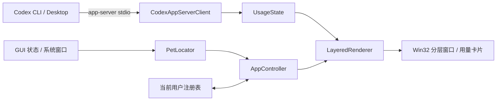

# 架构骨架

## macOS 核心组件

## 平台目录

项目现有 SwiftPM target 仍是完整的 macOS 实现。Windows 版本位于独立的
`src/CodexUsageLoop.Core` 与 `src/CodexUsageLoop.Windows`，不会让 AppKit、
ScreenCaptureKit 或 Win32 条件判断扩散到另一平台。

两套语言实现共享经过测试的协议和几何语义，而不是强行建立跨 Swift/C# ABI。
这保留了现有 macOS 源码和发布流程，也让 Windows 平台层只依赖原生系统 API。
Windows 详细设计和构建方式见 `docs/WINDOWS.md`。

## Windows 核心组件

## 依赖与数据流

- `AppController` 启动 app-server 客户端，以 30 秒频率刷新用量、以 1 秒频率轻量检查宠物窗口几何；它是唯一可以操作 `NSPanel`、菜单和计时器的模块。
- `CodexAppServerClient` 将 JSON-RPC `rateLimits` 响应映射为 `UsageSnapshot`，再通过主线程更新 `UsageStore`。
- `PetWindowLocator` 用 CGWindowList 找到候选容器窗口；候选评分、宠物估算和坐标换算均为纯几何函数并有回归测试。未测量回退使用 Codex 公开的锚点与窗口容器：普通位置按容器中心对齐，边缘位置按 pet 代理中心对齐，围绕圆环的默认直径与顶边间隙由纯规则给出。`ScreenCaptureMascotLocator` 在已获授权时以实测可见 pet 边界替代这些估算；首次定位或容器／布局变化时采集三帧短样本并取中位数，稳定时复用缓存，失败才回退至估算几何。
- `UsageView` 根据 `UsageStore` 渲染圆环和详情卡，不直接访问系统 API 或 app-server。
- `UserDefaults` 仅持久化展示偏好：常驻、自由拖动、圆环位置、围绕缩放、颜色、菜单栏图标和随 Codex pet 启动；实时额度、窗口几何与截图永不落盘。
- macOS `UsageStore.isRefreshing`／`statusText` 与 Windows
  `UsageState.IsRefreshing`／`StatusText` 共享相同展示语义：刷新中优先；
  失败且已有快照时保留旧数据并显示失败状态；无快照时显示具体错误。
- Windows `AppController` 是唯一 Win32 装配入口；Core 层只保存模型、parser、
  纯几何及样式规则，不依赖 User32、GDI+ 或 Shell。

## 固定边界

| 决策点 | 选择 | ADR |
| --- | --- | --- |
| 应用形态 | SwiftPM 原生 macOS accessory app | D-001 |
| 用量来源 | 本机 Codex app-server 标准输入输出协议 | D-002 |
| 依赖存储 | 无自有服务端、无数据库 | D-003 |
| 宠物定位 | CGWindowList 优先，ScreenCaptureKit 可选细化 | D-004 |
| 隐私边界 | 不读取认证文件，不保存截图 | D-005 |
| 发布形态 | 开源 Release、本地 ad-hoc 完整性校验、无公证 | D-006 |
| Windows 平台层 | 独立 .NET 10／Win32 前端 | D-015 |
| 更新入口 | 不检查更新，仅由系统浏览器打开官方 Releases | D-016 |
| 刷新职责 | 用量刷新与 pet 几何重测分离 | D-017 |
| macOS 13 | 窗口几何估算；菜单、授权与捕获已门禁，待实机 smoke | D-018 |
| Codex 兼容 | 按 Release 记录的已回归稳定版本与能力契约支持 | D-019 |

## 不可轻易改变的边界

- app-server 既是数据源也是兼容风险点；替换前必须获得新接口的真实契约。
- 屏幕录制是用户授权边界；首次需要精确定位时仅发起一次系统请求，拒绝后必须尊重用户选择并可靠降级，不能绕过缺失权限。
- 悬浮窗不抢焦点和默认点击穿透是核心交互约束；改变它们需要真实用户验收。
- 协议或定位不兼容时必须显示错误，不得用模拟值冒充真实用量。

## 发布验证边界

- macOS 13 捕获路径、授权入口和菜单状态已按系统版本门禁并由纯能力测试覆盖；
  仍须在 macOS 13 执行明确标示估算、可用且可重测的实机 smoke。
- Windows 原生消息循环、托盘、分层窗口和 DPI 集成需要在 Windows CI／实机
  验证；macOS 上的 Core 测试与交叉构建不能替代该门槛。
- 每次发布记录并回归确切的稳定 Codex Desktop／CLI 版本、真实 app-server
  响应和定位行为；发布后的新版本不自动视为已支持。
