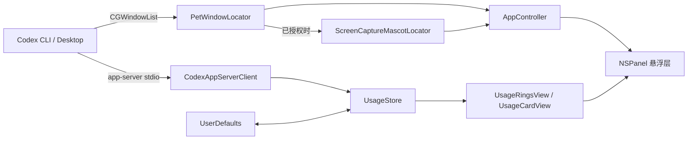

# 架构骨架

## 核心组件

## 依赖与数据流

- `AppController` 启动 app-server 客户端，分别以 30 秒和 1 秒频率刷新用量与宠物几何；它是唯一可以操作 `NSPanel`、菜单和计时器的模块。
- `CodexAppServerClient` 将 JSON-RPC `rateLimits` 响应映射为 `UsageSnapshot`，再通过主线程更新 `UsageStore`。
- `PetWindowLocator` 用 CGWindowList 找到候选容器窗口；候选评分、宠物估算和坐标换算均为纯几何函数并有回归测试。`ScreenCaptureMascotLocator` 只在已获授权时细化宠物矩形，失败即回退至估算几何。
- `UsageView` 根据 `UsageStore` 渲染圆环和详情卡，不直接访问系统 API 或 app-server。
- `UserDefaults` 仅持久化展示偏好：常驻、自由拖动和圆环位置；实时额度永不落盘。

## 固定边界

| 决策点 | 选择 | ADR |
| --- | --- | --- |
| 应用形态 | SwiftPM 原生 macOS accessory app | D-001 |
| 用量来源 | 本机 Codex app-server 标准输入输出协议 | D-002 |
| 依赖存储 | 无自有服务端、无数据库 | D-003 |
| 宠物定位 | CGWindowList 优先，ScreenCaptureKit 可选细化 | D-004 |
| 隐私边界 | 不读取认证文件，不保存截图 | D-005 |
| 发布形态 | 开源 Release、本地 ad-hoc 完整性校验、无公证 | D-006 |

## 不可轻易改变的边界

- app-server 既是数据源也是兼容风险点；替换前必须获得新接口的真实契约。
- 屏幕录制是用户授权边界，不能为了精确定位而主动弹出授权框或绕过缺失权限。
- 悬浮窗不抢焦点和默认点击穿透是核心交互约束；改变它们需要真实用户验收。

## 待澄清

- 最低支持版本目前为 macOS 13，而 ScreenCaptureKit 精确定位路径要求 macOS 14；需在兼容性验收批次决定是否调整宣传口径或实现 macOS 13 等价路径。
- 选择开源许可证、官方 Release 托管位置与校验和发布流程。
